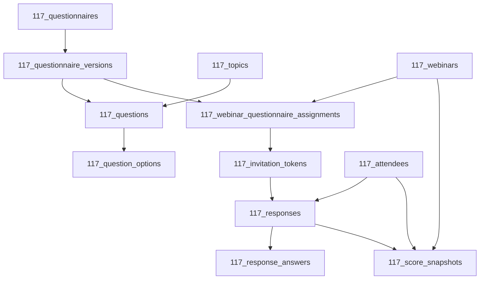

# Database Schema Draft

## Conventions

- All table names use the `117_` prefix.
- Because Postgres identifiers cannot start with a digit unless quoted, these table names must be created as quoted identifiers in SQL, for example `"117_webinars"`.
- Use lowercase snake_case for all table and column names.
- Use `uuid` primary keys and `timestamptz` timestamps.
- Keep questionnaire definitions versioned and make published versions immutable.
- Store raw answers separately from derived scores.
- Use soft archive fields for admin-managed records rather than hard deletes.

## Relationship Overview

## Tables

### `117_admin_profiles`

Purpose:

- Map authenticated Supabase users to application administrator profiles.

Key columns:

- `user_id` uuid primary key, references `auth.users(id)`
- `display_name` text
- `created_at` timestamptz
- `updated_at` timestamptz

Notes:

- Existence of a row means the user is an administrator.
- This table supports admin route protection and RLS checks.

### `117_webinars`

Purpose:

- Store webinar records that questionnaires are assigned to.

Key columns:

- `id` uuid primary key
- `title` text
- `description` text
- `starts_at` timestamptz
- `ends_at` timestamptz
- `timezone` text
- `status` text
- `created_by` uuid, references `auth.users(id)`
- `updated_by` uuid, references `auth.users(id)`
- `archived_at` timestamptz
- `created_at` timestamptz
- `updated_at` timestamptz

Notes:

- Suggested status values: `draft`, `published`, `completed`, `archived`.

### `117_questionnaires`

Purpose:

- Store reusable questionnaire containers.

Key columns:

- `id` uuid primary key
- `slug` text, unique
- `title` text
- `description` text
- `status` text
- `duplicated_from_questionnaire_id` uuid, references `117_questionnaires(id)`
- `created_by` uuid, references `auth.users(id)`
- `archived_at` timestamptz
- `created_at` timestamptz
- `updated_at` timestamptz

Notes:

- Suggested status values: `draft`, `published`, `archived`.
- Duplicating a questionnaire creates a new container, not a new version of the same container.

### `117_questionnaire_versions`

Purpose:

- Store immutable questionnaire snapshots.

Key columns:

- `id` uuid primary key
- `questionnaire_id` uuid, references `117_questionnaires(id)`
- `version_number` integer
- `status` text
- `change_summary` text
- `published_at` timestamptz
- `published_by` uuid, references `auth.users(id)`
- `created_by` uuid, references `auth.users(id)`
- `created_at` timestamptz
- `updated_at` timestamptz

Notes:

- Suggested status values: `draft`, `published`, `archived`.
- Unique constraint recommendation: `(questionnaire_id, version_number)`.
- When an admin edits a published questionnaire, create a new version instead of mutating the old one.

### `117_topics`

Purpose:

- Store knowledge topics used for scoring and progress reporting.

Key columns:

- `id` uuid primary key
- `topic_code` text, unique
- `name` text
- `description` text
- `display_order` integer
- `created_by` uuid, references `auth.users(id)`
- `archived_at` timestamptz
- `created_at` timestamptz
- `updated_at` timestamptz

Notes:

- Topics are shared labels that can be reused across questionnaire versions.
- Use `topic_code` for stable reporting and comparisons.

### `117_questions`

Purpose:

- Store questionnaire questions for a specific questionnaire version.

Key columns:

- `id` uuid primary key
- `questionnaire_version_id` uuid, references `117_questionnaire_versions(id)`
- `topic_id` uuid, references `117_topics(id)`
- `benchmark_key` text
- `prompt` text
- `help_text` text
- `question_type` text
- `required` boolean
- `display_order` integer
- `score_weight` numeric(12,4)
- `min_value` numeric
- `max_value` numeric
- `settings_jsonb` jsonb
- `created_by` uuid, references `auth.users(id)`
- `updated_by` uuid, references `auth.users(id)`
- `created_at` timestamptz
- `updated_at` timestamptz

Notes:

- Suggested question types: `short_text`, `long_text`, `single_choice`, `multiple_choice`, `dropdown`, `yes_no`, `number`, `rating_scale`, `date`, `email`, `phone_number`.
- `benchmark_key` is the stable comparison key used to match equivalent pre-webinar and post-webinar questions.
- `settings_jsonb` can hold type-specific configuration such as placeholders, rating labels, or scoring metadata.
- Unique constraint recommendation: `(questionnaire_version_id, display_order)`.

### `117_question_options`

Purpose:

- Store selectable options for choice-based questions.

Key columns:

- `id` uuid primary key
- `question_id` uuid, references `117_questions(id)`
- `option_key` text
- `option_label` text
- `display_order` integer
- `score_value` numeric(12,4)
- `is_default` boolean
- `is_other` boolean
- `created_at` timestamptz
- `updated_at` timestamptz

Notes:

- Unique constraint recommendation: `(question_id, option_key)` and `(question_id, display_order)`.
- `score_value` supports reusable scoring without hard-coding score logic in the UI.

### `117_webinar_questionnaire_assignments`

Purpose:

- Assign a published questionnaire version to a webinar stage.

Key columns:

- `id` uuid primary key
- `webinar_id` uuid, references `117_webinars(id)`
- `questionnaire_version_id` uuid, references `117_questionnaire_versions(id)`
- `stage` text
- `open_at` timestamptz
- `close_at` timestamptz
- `status` text
- `display_order` integer
- `created_by` uuid, references `auth.users(id)`
- `created_at` timestamptz
- `updated_at` timestamptz

Notes:

- Suggested stage values: `pre_webinar`, `post_webinar`.
- Suggested status values: `active`, `paused`, `archived`.
- Unique constraint recommendation: `(webinar_id, questionnaire_version_id, stage)`.

### `117_attendees`

Purpose:

- Store attendee identity details used across invitations, responses, and progress summaries.

Key columns:

- `id` uuid primary key
- `full_name` text
- `email` text
- `phone` text
- `organisation` text
- `email_normalized` text
- `first_seen_at` timestamptz
- `last_seen_at` timestamptz
- `created_at` timestamptz
- `updated_at` timestamptz

Notes:

- Keep the latest confirmed attendee details here.
- Preserve historical details on the response row so submissions remain stable even if the attendee profile changes later.

### `117_invitation_tokens`

Purpose:

- Store secure, non-guessable questionnaire invitation tokens.

Key columns:

- `id` uuid primary key
- `assignment_id` uuid, references `117_webinar_questionnaire_assignments(id)`
- `attendee_id` uuid, references `117_attendees(id)`
- `token_hash` text, unique
- `status` text
- `issued_by` uuid, references `auth.users(id)`
- `issued_at` timestamptz
- `claimed_at` timestamptz
- `expires_at` timestamptz
- `revoked_at` timestamptz
- `created_at` timestamptz
- `updated_at` timestamptz

Notes:

- Suggested token values: `issued`, `opened`, `completed`, `revoked`, `expired`.
- Store only a hash of the invitation token, not the raw token.
- The application should resolve the raw token to a hash and look up the row server-side.

### `117_responses`

Purpose:

- Store one attendee response per questionnaire invitation.

Key columns:

- `id` uuid primary key
- `assignment_id` uuid, references `117_webinar_questionnaire_assignments(id)`
- `invitation_token_id` uuid, references `117_invitation_tokens(id)`
- `attendee_id` uuid, references `117_attendees(id)`
- `status` text
- `respondent_name` text
- `respondent_email` text
- `respondent_phone` text
- `respondent_organisation` text
- `started_at` timestamptz
- `last_saved_at` timestamptz
- `submitted_at` timestamptz
- `locked_at` timestamptz
- `completion_percent` numeric(5,2)
- `answered_count` integer
- `unanswered_count` integer
- `created_at` timestamptz
- `updated_at` timestamptz

Notes:

- Suggested status values: `draft`, `submitted`, `locked`.
- Unique constraint recommendation: `(invitation_token_id)`.
- This row acts as the submission container for all answers and draft saves.
- Keep personal-detail snapshots here so the submission remains historically accurate.

### `117_response_answers`

Purpose:

- Store one answer per question per response.

Key columns:

- `id` uuid primary key
- `response_id` uuid, references `117_responses(id)`
- `question_id` uuid, references `117_questions(id)`
- `selected_option_id` uuid, references `117_question_options(id)`
- `raw_value_jsonb` jsonb
- `score_value` numeric(12,4)
- `is_unanswered` boolean
- `created_at` timestamptz
- `updated_at` timestamptz

Notes:

- Unique constraint recommendation: `(response_id, question_id)`.
- `raw_value_jsonb` can store text, numbers, dates, arrays, or structured values depending on question type.
- `selected_option_id` is useful for single-choice answers; multi-choice answers can be stored in `raw_value_jsonb`.
- `is_unanswered` keeps skipped answers separate from actual zero values.

### `117_score_snapshots`

Purpose:

- Store derived score results for attendee, topic, webinar, and comparison reporting.

Key columns:

- `id` uuid primary key
- `scope` text
- `stage` text
- `webinar_id` uuid, references `117_webinars(id)`
- `questionnaire_version_id` uuid, references `117_questionnaire_versions(id)`
- `assignment_id` uuid, references `117_webinar_questionnaire_assignments(id)`
- `topic_id` uuid, references `117_topics(id)`
- `attendee_id` uuid, references `117_attendees(id)`
- `response_id` uuid, references `117_responses(id)`
- `baseline_response_id` uuid, references `117_responses(id)`
- `raw_score` numeric(12,4)
- `weighted_score` numeric(12,4)
- `max_score` numeric(12,4)
- `percentage_score` numeric(6,3)
- `answered_count` integer
- `unanswered_count` integer
- `delta_absolute` numeric(12,4)
- `delta_percentage` numeric(6,3)
- `calculated_at` timestamptz

Notes:

- Suggested scope values: `attendee`, `topic`, `webinar`, `comparison`.
- Suggested stage values: `pre_webinar`, `post_webinar`, `combined`.
- These rows behave like cached reporting data and can be recalculated when needed.
- Store a baseline reference so pre-webinar and post-webinar progress can be compared safely, including zero-baseline cases.

### `117_audit_logs`  Optional but recommended

Purpose:

- Record security-sensitive admin activity and key data changes.

Key columns:

- `id` uuid primary key
- `actor_user_id` uuid, references `auth.users(id)`
- `action` text
- `entity_table` text
- `entity_id` uuid
- `before_data` jsonb
- `after_data` jsonb
- `created_at` timestamptz

Notes:

- Useful for tracking who changed webinars, questionnaires, questions, assignments, and scoring configuration.
- This table is optional for the first pass, but it is strongly recommended for a system that manages questionnaire definitions and results.

## Recommended Constraints And Indexes

- Primary keys on every table.
- Unique index on `117_questionnaire_versions(questionnaire_id, version_number)`.
- Unique index on `117_questions(questionnaire_version_id, display_order)`.
- Unique index on `117_question_options(question_id, option_key)`.
- Unique index on `117_question_options(question_id, display_order)`.
- Unique index on `117_webinar_questionnaire_assignments(webinar_id, questionnaire_version_id, stage)`.
- Unique index on `117_invitation_tokens(token_hash)`.
- Unique index on `117_responses(invitation_token_id)`.
- Unique index on `117_response_answers(response_id, question_id)`.
- Indexes on `117_responses(attendee_id)`, `117_responses(assignment_id)`, and `117_responses(submitted_at)`.
- Indexes on `117_score_snapshots(attendee_id)`, `117_score_snapshots(webinar_id)`, `117_score_snapshots(topic_id)`, and `117_score_snapshots(scope)`.
- Consider a partial index on active invitation tokens where `status` is not expired or revoked.

## RLS Notes

- Enable Row Level Security on every exposed table in `public`.
- Admin-managed tables should only be readable and writable by authenticated administrators.
- Attendee-facing data should be limited to the single invitation and response context the attendee is allowed to access.
- `117_invitation_tokens` should not be broadly readable from the browser.
- `117_responses` and `117_response_answers` should allow draft updates only until submission, then become effectively immutable.
- Update policies should always have both `USING` and `WITH CHECK`.
- If a view is ever introduced for reporting, use `security_invoker` behavior or keep the view in a non-exposed schema.

## Answer Storage Pattern

- Use `117_questions.settings_jsonb` for field-specific configuration such as placeholders, rating labels, and min or max options.
- Use `117_question_options.score_value` for choice-based scoring.
- Use `117_response_answers.raw_value_jsonb` to store the submitted answer in a type-safe but flexible way.
- Use `117_response_answers.score_value` to store the derived score used by progress calculations.
- Keep unanswered answers flagged explicitly rather than converting them to zero automatically.

